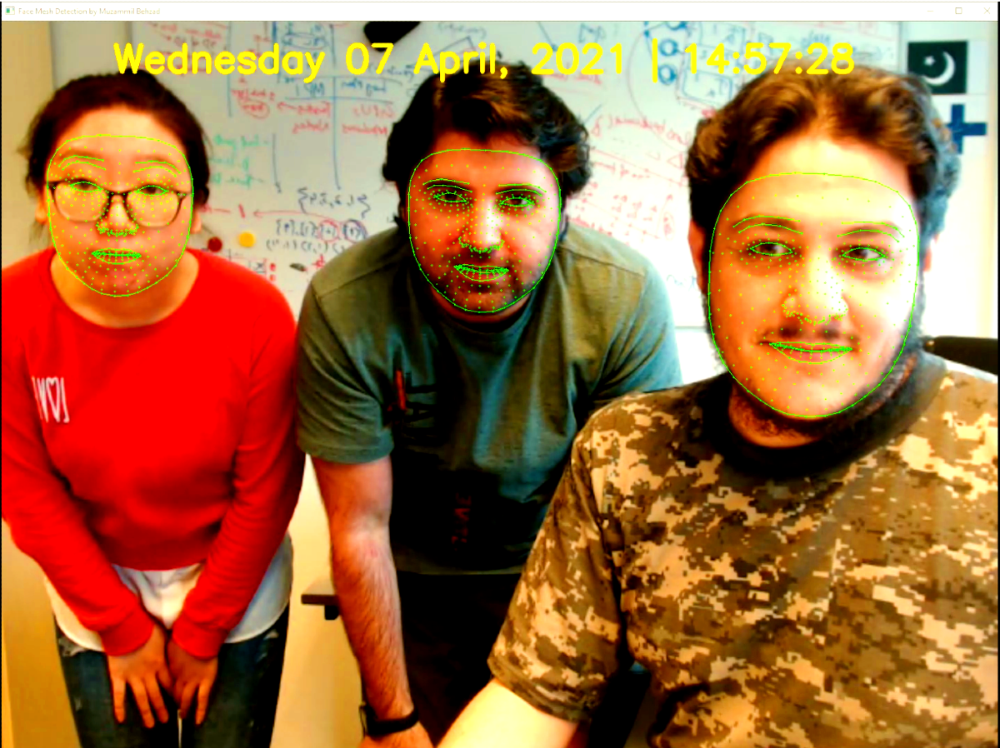

# Real-time Face Mesh Detection

This repo is for real-time face and face-mesh detection. However, It can be equally used for other images and videos in general.

1. Install the required packages listed in the `requirements.txt` file.
2. Run the code. Enjoy!

Live demo here on [YouTube](https://youtu.be/U2GVMsShIP0).

